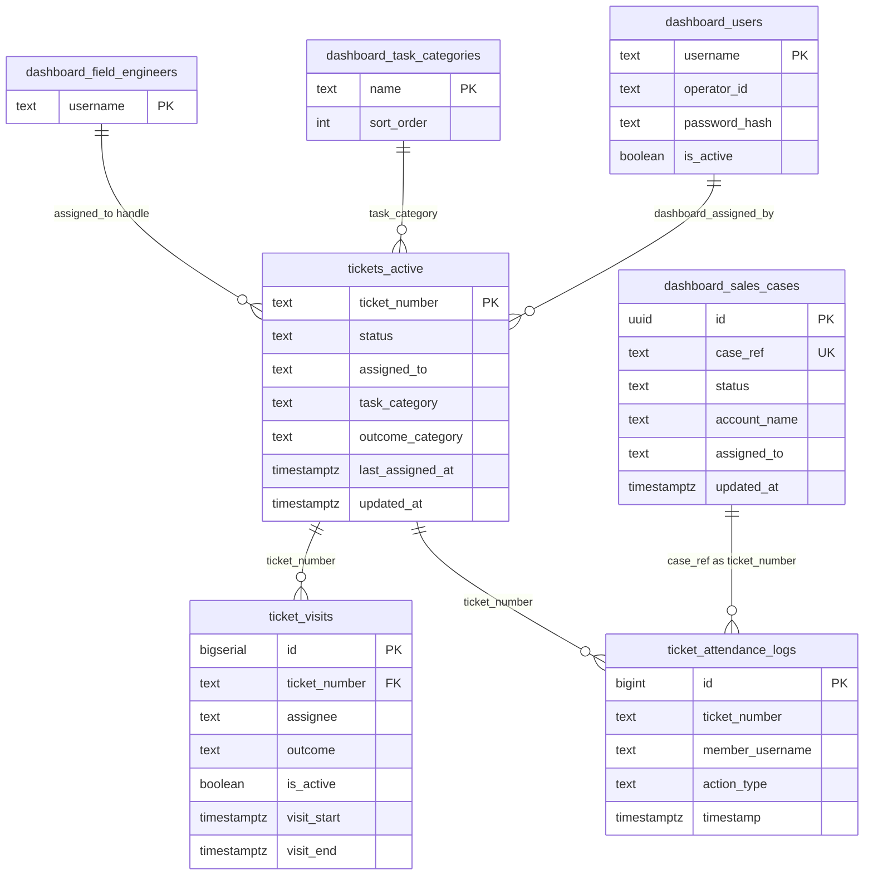

# NetOps Coverage Eye — Database Schema

**Database:** Supabase (PostgreSQL 15+)  
**Extensions:** `pgcrypto` (password hashing)  
**Storage:** Supabase Storage bucket `ticket-photos`  
**Last reviewed:** Against migrations through `20260716`

---

## 1. Entity Relationship Overview



**Note:** `ticket_attendance_logs.ticket_number` has **no FK** (dropped in migration `20260513`) so logs survive ticket deletes and can reference sales `case_ref` values.

---

## 2. Environment Variable → Table Mapping

| Environment variable | Default | PostgreSQL object |
|---------------------|---------|-------------------|
| `TICKETS_TABLE` | `tickets_active` | `public.tickets_active` |
| `SALES_CASES_TABLE` | `dashboard_sales_cases` | `public.dashboard_sales_cases` |
| `ATTENDANCE_LOGS_TABLE` | `ticket_attendance_logs` | `public.ticket_attendance_logs` |
| `TICKET_VISITS_TABLE` | `ticket_visits` | `public.ticket_visits` |
| `FIELD_ENGINEERS_TABLE` | `dashboard_field_engineers` | `public.dashboard_field_engineers` |
| `TASK_CATEGORIES_TABLE` | `dashboard_task_categories` | `public.dashboard_task_categories` |
| `BOT_SESSIONS_TABLE` | `bot_sessions` | `public.bot_sessions` *(no migration in repo)* |
| `TICKET_PHOTOS_BUCKET` | `ticket-photos` | `storage.buckets` |
| — | `dashboard_users` | Hardcoded table name (no env override) |

---

## 3. Tables (Detailed)

### 3.1 `public.tickets_active`

Primary store for **field complaint tickets**. Renamed from `public.tickets` (`20260512`).

| Column | Type | Nullable | Default | Description |
|--------|------|----------|---------|-------------|
| `ticket_number` | `text` | NO | — | **Primary key** |
| `assigned_to` | `text` | YES | — | Primary field engineer `@handle` |
| `assigned_to_2` | `text` | YES | — | Second engineer (`20260716`) |
| `task_category` | `text` | NO | — | Assigned work category |
| `outcome_category` | `text` | YES | — | Category at resolve (Performance credit) |
| `status` | `text` | YES | `'Daily Task'` | Queue driver |
| `field_response` | `text` | YES | — | Latest field reply text |
| `photo_url` | `text` | YES | — | Latest field photo URL |
| `responded_at` | `timestamptz` | YES | — | Latest field response time |
| `field_responded_by` | `text` | YES | — | Telegram replier handle |
| `additional_info` | `text` | YES | — | Assignment / admin notes |
| `dashboard_assigned_by` | `text` | YES | — | Operator who assigned |
| `assignment_telegram_chat_id` | `bigint` | YES | — | Assignment message chat |
| `assignment_telegram_message_id` | `bigint` | YES | — | Assignment message id |
| `last_response_telegram_chat_id` | `bigint` | YES | — | Reply message chat |
| `last_response_telegram_message_id` | `bigint` | YES | — | Reply message id |
| `last_assigned_at` | `timestamptz` | YES | `now()` | Last assign/reassign |
| `unattended_nudge_sent_at` | `timestamptz` | YES | — | 6h nudge sent |
| `marked_unattended_at` | `timestamptz` | YES | — | Permanent unattended flag |
| `follow_up_at` | `timestamptz` | YES | — | Investigation follow-up due |
| `follow_up_note` | `text` | YES | — | Follow-up note |
| `created_at` | `timestamptz` | YES | `now()` | |
| `updated_at` | `timestamptz` | YES | `now()` | Auto-updated by trigger |

**Status values (current):** `Daily Task`, `Open`, `On Hold`, `Under Investigation`, `Resolved`, `Unattended`

**Indexes:**

```sql
CREATE INDEX tickets_active_outcome_category_idx
  ON public.tickets_active (outcome_category)
  WHERE outcome_category IS NOT NULL;
```

**Triggers:**

| Trigger | Event | Function |
|---------|-------|----------|
| `trg_tickets_set_updated_at` | BEFORE UPDATE | `public.set_updated_at()` |

**RLS:** Enabled — `anon` SELECT, INSERT, UPDATE, DELETE

---

### 3.2 `public.ticket_visits`

Visit cycles for field ticket accountability and Performance matrix.

| Column | Type | Nullable | Default | Description |
|--------|------|----------|---------|-------------|
| `id` | `bigserial` | NO | auto | **Primary key** |
| `ticket_number` | `text` | NO | — | FK → `tickets_active(ticket_number)` ON DELETE CASCADE |
| `assignee` | `text` | NO | — | Canonical `@lowercase` handle |
| `visit_start` | `timestamptz` | NO | `now()` | Cycle start |
| `visit_end` | `timestamptz` | YES | — | NULL = open cycle |
| `outcome` | `text` | NO | `'assigned'` | CHECK: `assigned`, `responded`, `reassigned`, `unattended`, `on_hold` |
| `response_note` | `text` | YES | — | Field reply text |
| `photo_url` | `text` | YES | — | Field photo URL |
| `closed_by` | `text` | NO | `'system'` | Who closed cycle |
| `is_active` | `boolean` | NO | `true` | One active row per ticket |

**Indexes:**

| Index | Columns |
|-------|---------|
| `ticket_visits_ticket_idx` | `(ticket_number)` |
| `ticket_visits_assignee_idx` | `(assignee)` |
| `ticket_visits_open_idx` | `(ticket_number) WHERE visit_end IS NULL` |
| `ticket_visits_start_idx` | `(visit_start)` |
| `idx_visit_assignee_active` | `(assignee, is_active)` |
| `idx_visit_assignee_outcome_start` | `(assignee, outcome, visit_start DESC)` |
| `idx_visit_ticket_active` | `(ticket_number) WHERE is_active = true` |

**Triggers:**

| Trigger | Event | Function |
|---------|-------|----------|
| `trg_reassign_ticket` | BEFORE INSERT | `public.handle_ticket_reassignment()` |

**RLS:** Enabled — `anon` SELECT, INSERT, UPDATE, DELETE

---

### 3.3 `public.ticket_attendance_logs`

Append-only audit trail for assignments, responses, and admin actions.

| Column | Type | Nullable | Default | Description |
|--------|------|----------|---------|-------------|
| `id` | `bigint` | NO | identity | **Primary key** |
| `ticket_number` | `text` | YES | — | Ticket # or sales `case_ref` |
| `member_username` | `text` | NO | — | Actor handle |
| `action_type` | `text` | NO | — | Event type (see below) |
| `note` | `text` | YES | — | Free text |
| `photo_url` | `text` | YES | — | Photo URL |
| `timestamp` | `timestamptz` | NO | `now()` | Event time |
| `telegram_chat_id` | `bigint` | YES | — | Source message chat |
| `telegram_message_id` | `bigint` | YES | — | Source message id |

**Common `action_type` values:**

`Assignment`, `Response`, `Nudge`, `AutoUnattended`, `OnHold`, `Resolved`, `TicketQueued`, `AssignmentUpdated`, `TransferredFromSales`, `TransferredToSales`, `ReassignedFromOpen`, `ReassignedFromInvestigation`, `ReassignedFromOnHold`, `ReassignedFromPending`, `Deleted`, `LegacyLogin`, `NoAnswer`

`LegacyLogin` — dashboard sign-in via shared `DASHBOARD_PASSWORD`; `member_username` is the self-declared Operator ID (identity not verified).

**Indexes:**

| Index | Columns |
|-------|---------|
| `idx_attendance_logs_ticket` | `(ticket_number)` |
| `idx_attendance_logs_member_lower` | `(lower(member_username))` |
| `idx_attendance_logs_ts` | `(timestamp DESC)` |
| `ticket_attendance_logs_ticket_number_idx` | `(ticket_number)` |
| `ticket_attendance_logs_telegram_msg_idx` | `(telegram_chat_id, telegram_message_id) WHERE telegram_message_id IS NOT NULL` |

**RLS:** Enabled — `anon` SELECT, INSERT only (no UPDATE/DELETE)

---

### 3.4 `public.dashboard_sales_cases`

Sales pipeline cases (separate from field tickets).

| Column | Type | Nullable | Default | Description |
|--------|------|----------|---------|-------------|
| `id` | `uuid` | NO | `gen_random_uuid()` | **Primary key** |
| `case_ref` | `text` | NO | — | External case/ticket ID |
| `account_name` | `text` | NO | — | Customer/resort name |
| `attended_by` | `text` | NO | `'Mular_s'` | Sales queue owner |
| `sales_priority` | `text` | NO | `'Standard'` | Priority label |
| `account_region` | `text` | NO | — | SOC, EOC, KOC, LOC, AOC, GOC, CENTRAL |
| `sales_category` | `text` | NO | — | Intent/category |
| `description` | `text` | YES | — | Intake description |
| `status` | `text` | NO | `'Sales ticket'` | Queue driver |
| `admin_owner` | `text` | YES | — | Last admin operator |
| `dispatch_type` | `text` | YES | — | Site visit dispatch type |
| `dispatch_region` | `text` | YES | — | Dispatch region |
| `assigned_to` | `text` | YES | — | Field engineer |
| `assigned_to_2` | `text` | YES | — | Second engineer |
| `field_task_category` | `text` | YES | — | Field category on dispatch |
| `dispatch_reason` | `text` | YES | — | Reason for site visit |
| `additional_info` | `text` | YES | — | Work panel notes |
| `close_note` | `text` | YES | — | Note on resolve |
| `last_assigned_at` | `timestamptz` | YES | — | Last field assignment |
| `created_at` | `timestamptz` | NO | `now()` | |
| `updated_at` | `timestamptz` | NO | `now()` | Last status/field change |

**Status values:** `Sales ticket`, `Investigation`, `Regional for site visit`, `Design`, `Resolved`

**Indexes:**

| Index | Columns |
|-------|---------|
| `dashboard_sales_cases_status_idx` | `(status)` |
| `dashboard_sales_cases_updated_idx` | `(updated_at DESC)` |
| `dashboard_sales_cases_last_assigned_idx` | `(last_assigned_at DESC) WHERE last_assigned_at IS NOT NULL` |

**RLS:** Enabled — `anon` SELECT, INSERT, UPDATE, DELETE

---

### 3.5 `public.dashboard_users`

Dashboard login accounts (not field engineers).

| Column | Type | Nullable | Default | Description |
|--------|------|----------|---------|-------------|
| `username` | `text` | NO | — | **Primary key**; must be lowercase |
| `operator_id` | `text` | NO | — | Display name for assignments/logs |
| `password_hash` | `text` | NO | — | bcrypt hash |
| `is_active` | `boolean` | NO | `true` | Disabled users cannot login |
| `reset_token_hash` | `text` | YES | — | Password reset token |
| `reset_token_expires_at` | `timestamptz` | YES | — | Reset expiry (15 min) |
| `created_at` | `timestamptz` | NO | `now()` | |
| `updated_at` | `timestamptz` | NO | `now()` | |

**Indexes:**

```sql
CREATE UNIQUE INDEX dashboard_users_operator_id_lower_idx
  ON public.dashboard_users (lower(operator_id));
```

**RLS:** Enabled — **no anon policies**; access via SECURITY DEFINER RPCs only

---

### 3.6 `public.dashboard_field_engineers`

Allowed field engineer Telegram handles for Command Center pickers.

| Column | Type | Nullable | Default |
|--------|------|----------|---------|
| `username` | `text` | NO | — |
| `created_at` | `timestamptz` | NO | `now()` |

**PK:** `username`  
**Unique index:** `dashboard_field_engineers_username_lower_idx` on `lower(username)`  
**RLS:** `anon` SELECT, INSERT, DELETE

---

### 3.7 `public.dashboard_task_categories`

Task category picklist for CSM assignments.

| Column | Type | Nullable | Default |
|--------|------|----------|---------|
| `name` | `text` | NO | — |
| `sort_order` | `int` | NO | `0` |
| `created_at` | `timestamptz` | NO | `now()` |

**PK:** `name`  
**Unique index:** `dashboard_task_categories_name_lower_idx` on `lower(name)`  
**RLS:** `anon` SELECT, INSERT, DELETE

---

### 3.8 `public.bot_sessions` *(referenced in code, no migration)*

Telegram bot session state for `/respond` continuity.

| Column | Type | Description |
|--------|------|-------------|
| `telegram_user_id` | `bigint` | **PK** |
| `chat_id` | `bigint` | Active chat |
| `active_ticket` | `text` | Ticket awaiting response |
| `updated_at` | `timestamptz` | Last activity |

---

### 3.9 `public.ticket_responses` *(legacy)*

Append-only log used by older `/respond` path. No migration DDL in repo.

| Column | Type | Description |
|--------|------|-------------|
| `ticket_id` | `text` | Ticket number |
| `user_handle` | `text` | Replier |
| `response_data` | `text` | Response payload |

---

## 4. Views

### `public.engineer_visit_summary`

Aggregates visit counts per assignee and outcome.

| Column | Source |
|--------|--------|
| `assignee` | `ticket_visits.assignee` |
| `outcome` | `ticket_visits.outcome` |
| `visit_count` | COUNT(*) |
| `first_visit_at` | MIN(visit_start) |
| `last_visit_at` | MAX(visit_start) |

---

## 5. Functions & RPCs

| Function | Type | Purpose |
|----------|------|---------|
| `set_updated_at()` | Trigger | Sets `NEW.updated_at = now()` |
| `handle_ticket_reassignment()` | Trigger | Closes prior active visit on new insert |
| `close_ticket_visit_responded(...)` | Callable | Close active visit as responded |
| `current_ticket_assignee(text)` | Callable | Returns active visit assignee |
| `dashboard_users_configured()` | SECURITY DEFINER | Returns whether any active users exist |
| `dashboard_verify_login(text, text)` | SECURITY DEFINER | Username/password login |
| `dashboard_request_password_reset(text)` | SECURITY DEFINER | Issue reset code |
| `dashboard_reset_password(text, text, text)` | SECURITY DEFINER | Complete reset |
| `dashboard_admin_list_users(text, text)` | SECURITY DEFINER | List users (admin auth) |
| `dashboard_admin_create_user(...)` | SECURITY DEFINER | Create user |
| `dashboard_admin_set_user_active(...)` | SECURITY DEFINER | Enable/disable user |

---

## 6. Storage

### Bucket: `ticket-photos`

| Property | Value |
|----------|-------|
| Public | Yes |
| Used by | Bot photo upload, dashboard photo gallery |

**RLS on `storage.objects` (anon):**

| Policy | Command |
|--------|---------|
| `ticket_photos_anon_insert` | INSERT where `bucket_id = 'ticket-photos'` |
| `ticket_photos_anon_select` | SELECT where `bucket_id = 'ticket-photos'` |
| `ticket_photos_anon_update` | UPDATE where `bucket_id = 'ticket-photos'` |

No DELETE policy — photos retained for audit.

---

## 7. RLS Summary

| Table | RLS | anon SELECT | anon INSERT | anon UPDATE | anon DELETE |
|-------|:---:|:-----------:|:-----------:|:-----------:|:-----------:|
| `tickets_active` | ✓ | ✓ | ✓ | ✓ | ✓ |
| `ticket_visits` | ✓ | ✓ | ✓ | ✓ | ✓ |
| `ticket_attendance_logs` | ✓ | ✓ | ✓ | — | — |
| `dashboard_sales_cases` | ✓ | ✓ | ✓ | ✓ | ✓ |
| `dashboard_users` | ✓ | — | — | — | — |
| `dashboard_field_engineers` | ✓ | ✓ | ✓ | — | ✓ |
| `dashboard_task_categories` | ✓ | ✓ | ✓ | — | ✓ |
| `storage.objects` (ticket-photos) | ✓ | ✓ | ✓ | ✓ | — |

**Security note:** Production should use Supabase service role for server-side bot; dashboard uses anon key with RLS. Consider tightening RLS for production beyond `anon` full access.

---

## 8. Referential Integrity

| Relationship | Enforcement |
|--------------|-------------|
| `ticket_visits.ticket_number` → `tickets_active.ticket_number` | FK ON DELETE CASCADE |
| `ticket_attendance_logs.ticket_number` → tickets | **No FK** (intentional) |
| Sales `case_ref` → attendance logs | Logical only (same column name) |

---

## 9. Migration Order

Apply all files in `supabase/migrations/` sorted by filename (ISO date prefix). Key schema-defining migrations:

| Migration | Change |
|-----------|--------|
| `20260512_history_and_rename` | Rename tickets → tickets_active; attendance logs |
| `20260515` | Field engineers table |
| `20260520` | Dashboard users + pgcrypto |
| `20260521` | Task categories |
| `20260620` | Sales cases table |
| `20260621` | Sales close_note |
| `20260629` | Sales attended_by |
| `20260630` | Sales last_assigned_at |
| `20260702`–`20260706` | Ticket visits + accountability |
| `20260708` | outcome_category |
| `20260715` | marked_unattended_at |
| `20260716` | assigned_to_2 on tickets + sales |

After applying: `NOTIFY pgrst, 'reload schema';` (included in migrations)

---

## 10. Sample Queries

**Active tickets by queue:**

```sql
SELECT status, count(*)
FROM public.tickets_active
GROUP BY status
ORDER BY count(*) DESC;
```

**Visit fair credit (responded in range):**

```sql
SELECT assignee, count(DISTINCT ticket_number) AS tickets_handled
FROM public.ticket_visits
WHERE outcome = 'responded'
  AND visit_start >= '2026-06-07'::timestamptz
  AND visit_start <  '2026-06-14'::timestamptz
GROUP BY assignee;
```

**Sales cases in range:**

```sql
SELECT case_ref, status, updated_at, assigned_to
FROM public.dashboard_sales_cases
WHERE updated_at >= '2026-06-07'::timestamptz
  AND updated_at <= '2026-06-13 23:59:59+05'::timestamptz;
```

---

## 11. Related Documents

- [DEVELOPER_REQUIREMENTS.md](./DEVELOPER_REQUIREMENTS.md) — screens, workflows, business rules
- [USER_STORIES.md](./USER_STORIES.md) — role-based user stories
