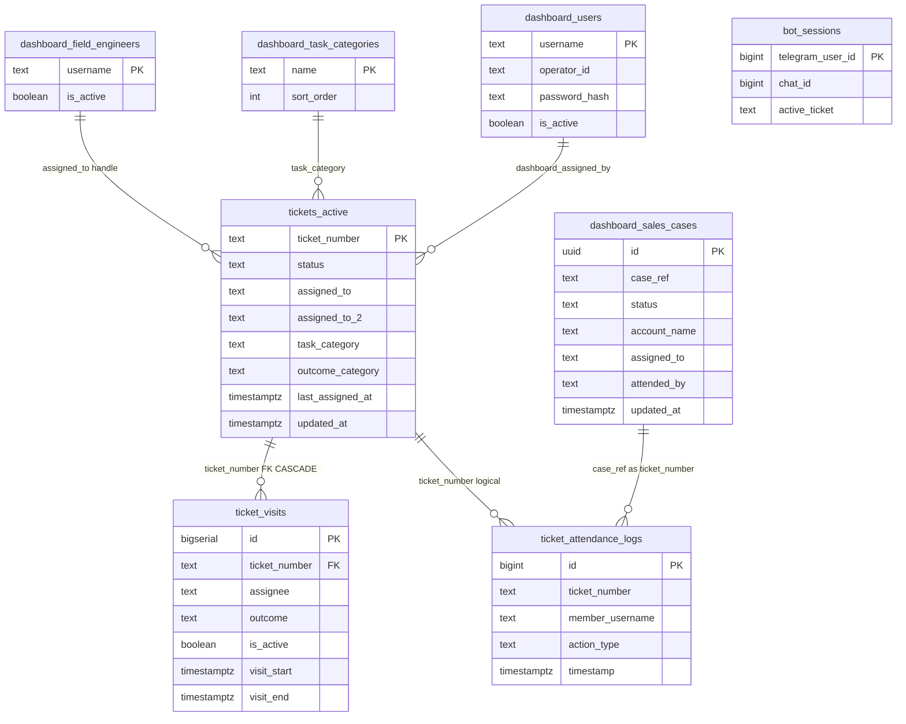

# NetOps Coverage Eye — Database Schema

**Database:** Supabase (PostgreSQL 15+)  
**Extensions:** `pgcrypto` (password hashing)  
**Storage:** Supabase Storage bucket `ticket-photos`  
**Last reviewed:** Migrations through `20260716_assigned_to_second_engineer.sql` (56 files in `supabase/migrations/`); verified against live schema (9 public tables) 2026-06. Adds derived **Follow up** queue note.

---

## 1. Entity Relationship Overview



**Important:** `ticket_attendance_logs.ticket_number` has **no FK** — logs survive ticket deletes and store sales `case_ref` values in the same column.

---

## 2. Environment Variable → Table Mapping

| Environment variable | Default | PostgreSQL object |
|---------------------|---------|-------------------|
| `TICKETS_TABLE` | `tickets_active` | `public.tickets_active` |
| `SALES_CASES_TABLE` | `dashboard_sales_cases` | `public.dashboard_sales_cases` |
| `ATTENDANCE_LOGS_TABLE` | `ticket_attendance_logs` | `public.ticket_attendance_logs` |
| `TICKET_VISITS_TABLE` | `ticket_visits` | `public.ticket_visits` |
| `FIELD_ENGINEERS_TABLE` | `dashboard_field_engineers` | `public.dashboard_field_engineers` |
| `TASK_CATEGORIES_TABLE` | `dashboard_task_categories` | `public.dashboard_task_categories` |
| `BOT_SESSIONS_TABLE` | `bot_sessions` | `public.bot_sessions` |
| `TICKET_PHOTOS_BUCKET` | `ticket-photos` | `storage.buckets` |
| — | (hardcoded) | `public.dashboard_users` |
| — | (hardcoded) | `public.ticket_responses` (legacy) |

---

## 3. Tables (Detailed)

### 3.1 `public.tickets_active`

Primary store for **field complaint tickets**. Renamed from `public.tickets` (`20260512`).

| Column | Type | Nullable | Default | Description |
|--------|------|----------|---------|-------------|
| `ticket_number` | `text` | NO | — | **Primary key** |
| `assigned_to` | `text` | YES | — | Primary field engineer `@handle` |
| `assigned_to_2` | `text` | YES | — | Second engineer (`20260716`) |
| `task_category` | `text` | NO | — | Assigned work category |
| `outcome_category` | `text` | YES | — | Category at resolve (Performance credit) |
| `status` | `text` | YES | `'Daily Task'` | Queue driver |
| `field_response` | `text` | YES | — | Latest field reply text |
| `photo_url` | `text` | YES | — | Latest field photo URL |
| `responded_at` | `timestamptz` | YES | — | Latest field response time |
| `field_responded_by` | `text` | YES | — | Telegram replier handle |
| `additional_info` | `text` | YES | — | Assignment / admin notes |
| `dashboard_assigned_by` | `text` | YES | — | Operator who assigned |
| `assignment_telegram_chat_id` | `bigint` | YES | — | Assignment message chat |
| `assignment_telegram_message_id` | `bigint` | YES | — | Assignment message id |
| `last_response_telegram_chat_id` | `bigint` | YES | — | Reply message chat |
| `last_response_telegram_message_id` | `bigint` | YES | — | Reply message id |
| `last_assigned_at` | `timestamptz` | YES | `now()` | Last assign/reassign |
| `unattended_nudge_sent_at` | `timestamptz` | YES | — | 6h nudge sent |
| `marked_unattended_at` | `timestamptz` | YES | — | Permanent unattended flag |
| `follow_up_at` | `timestamptz` | YES | — | Investigation follow-up due |
| `follow_up_note` | `text` | YES | — | Follow-up note |
| `created_at` | `timestamptz` | YES | `now()` | |
| `updated_at` | `timestamptz` | YES | `now()` | Auto-updated by trigger |

**Status CHECK values:** `Daily Task`, `Open`, `On Hold`, `Under Investigation`, `Resolved`, `Unattended`

**UI mapping:** `Open` → **Needs Review**; legacy aliases normalized in app code.

**Indexes:**

```sql
CREATE INDEX tickets_active_outcome_category_idx
  ON public.tickets_active (outcome_category)
  WHERE outcome_category IS NOT NULL;
```

**Triggers:** `trg_tickets_set_updated_at` → `set_updated_at()`

**RLS:** Enabled — anon SELECT, INSERT, UPDATE, DELETE

---

### 3.2 `public.ticket_visits`

Visit cycles for field ticket accountability and Performance matrix.

| Column | Type | Nullable | Default | Description |
|--------|------|----------|---------|-------------|
| `id` | `bigserial` | NO | auto | **Primary key** |
| `ticket_number` | `text` | NO | — | FK → `tickets_active` ON DELETE CASCADE |
| `assignee` | `text` | NO | — | Canonical `@lowercase` handle |
| `visit_start` | `timestamptz` | NO | `now()` | Cycle start |
| `visit_end` | `timestamptz` | YES | — | NULL = open cycle |
| `outcome` | `text` | NO | `'assigned'` | CHECK below |
| `response_note` | `text` | YES | — | Field reply text |
| `photo_url` | `text` | YES | — | Field photo URL |
| `closed_by` | `text` | NO | `'system'` | `bot`, `dashboard`, `system` |
| `is_active` | `boolean` | NO | `true` | One active row per ticket |

**Outcome CHECK:** `assigned`, `responded`, `reassigned`, `unattended`, `on_hold`

**Indexes:** `(ticket_number)`, `(assignee)`, partial open/active indexes, `(visit_start)`, composite assignee/outcome

**Triggers:** `trg_reassign_ticket` → `handle_ticket_reassignment()`

**RLS:** anon SELECT, INSERT, UPDATE, DELETE

---

### 3.3 `public.ticket_attendance_logs`

Append-only audit trail. Polymorphic: field tickets and sales cases share this table.

| Column | Type | Nullable | Default | Description |
|--------|------|----------|---------|-------------|
| `id` | `bigint` | NO | identity | **Primary key** |
| `ticket_number` | `text` | YES | — | Ticket # **or** sales `case_ref` |
| `member_username` | `text` | NO | — | Actor handle or Operator ID |
| `action_type` | `text` | NO | — | Event type |
| `note` | `text` | YES | — | Free text |
| `photo_url` | `text` | YES | — | Photo URL |
| `timestamp` | `timestamptz` | NO | `now()` | Event time |
| `telegram_chat_id` | `bigint` | YES | — | Source message chat |
| `telegram_message_id` | `bigint` | YES | — | Source message id |

**Common `action_type` values:**

| Value | Meaning |
|-------|---------|
| `Assignment` | New assignment |
| `AssignmentUpdated` | Assignment changed |
| `Response` | Field reply |
| `ResponseUndone` | Telegram undo |
| `Resolved` | Ticket/case resolved |
| `OnHold` | Moved to On Hold |
| `Nudge` | 6h unattended nudge |
| `AutoUnattended` | End-of-day auto-close |
| `TicketQueued` | Queued without Telegram |
| `TransferredFromSales` / `TransferredToSales` | Cross-pipeline transfer |
| `ReassignedFromOpen` / `ReassignedFromInvestigation` / `ReassignedFromOnHold` / `ReassignedFromPending` | Reassign audit |
| `Deleted` | Row deleted |
| `LegacyLogin` | Shared-password dashboard login |
| `AdminClosed` | Admin close without field completion |
| `NoAnswer` | Legacy (renamed OnHold) |

**RLS:** anon SELECT, INSERT only (no UPDATE/DELETE)

---

### 3.4 `public.dashboard_sales_cases`

Sales pipeline cases (separate from field tickets).

| Column | Type | Nullable | Default | Description |
|--------|------|----------|---------|-------------|
| `id` | `uuid` | NO | `gen_random_uuid()` | **Primary key** |
| `case_ref` | `text` | NO | — | External case/ticket ID (lookup key) |
| `account_name` | `text` | NO | — | Customer/resort name |
| `attended_by` | `text` | NO | `'Admin'` | Queue owner; app stores **`Admin`** for undispatched |
| `sales_priority` | `text` | NO | `'Standard'` | Strategic, High, Urgent, Standard |
| `account_region` | `text` | NO | — | SOC, EOC, KOC, LOC, AOC, GOC, CENTRAL |
| `sales_category` | `text` | NO | — | Intent/category |
| `description` | `text` | YES | — | Intake description |
| `status` | `text` | NO | `'Sales ticket'` | Queue driver |
| `admin_owner` | `text` | YES | — | Last operator (operational — not Performance credit) |
| `dispatch_type` | `text` | YES | — | Site visit dispatch type |
| `dispatch_region` | `text` | YES | — | Dispatch region |
| `assigned_to` | `text` | YES | — | Field engineer |
| `assigned_to_2` | `text` | YES | — | Second engineer (`20260716`) |
| `field_task_category` | `text` | YES | — | Field category on dispatch |
| `dispatch_reason` | `text` | YES | — | Reason for site visit |
| `additional_info` | `text` | YES | — | Work notes |
| `close_note` | `text` | YES | — | Note on resolve |
| `last_assigned_at` | `timestamptz` | YES | — | Last field assignment |
| `created_at` | `timestamptz` | NO | `now()` | |
| `updated_at` | `timestamptz` | NO | `now()` | |

**Status CHECK:** `Sales ticket`, `Investigation`, `Regional for site visit`, `Design`, `Resolved`

**Performance credit:** Field engineer when `assigned_to` set; else **Admin** bucket. `admin_owner` does not receive credit.

**Indexes:** `(status)`, `(updated_at DESC)`, partial `(last_assigned_at DESC)`

**RLS:** anon SELECT, INSERT, UPDATE, DELETE

---

### 3.5 `public.dashboard_users`

Dashboard login accounts.

| Column | Type | Nullable | Default |
|--------|------|----------|---------|
| `username` | `text` | NO | — |
| `operator_id` | `text` | NO | — |
| `password_hash` | `text` | NO | — |
| `is_active` | `boolean` | NO | `true` |
| `reset_token_hash` | `text` | YES | — |
| `reset_token_expires_at` | `timestamptz` | YES | — |
| `created_at` | `timestamptz` | NO | `now()` |
| `updated_at` | `timestamptz` | NO | `now()` |

**PK:** `username` (lowercase enforced in RPC)  
**Unique:** `lower(operator_id)`  
**RLS:** No anon policies — SECURITY DEFINER RPCs only

**Seed (migration):** `admin`, `ibeyx` with temporary password `ChangeMeNow!`

---

### 3.6 `public.dashboard_field_engineers`

Field engineer roster for assign pickers and Telegram attribution.

| Column | Type | Nullable | Default |
|--------|------|----------|---------|
| `username` | `text` | NO | — |
| `is_active` | `boolean` | NO | `true` |
| `created_at` | `timestamptz` | NO | `now()` |

**PK:** `username`  
**Soft delete:** `is_active = false` (`20260620_field_engineers_soft_delete.sql`)  
**Unique index:** `lower(username)` on all rows; partial active index for pickers  
**RLS:** anon SELECT, INSERT, UPDATE, DELETE

---

### 3.7 `public.dashboard_task_categories`

Task category picklist for CSM assignments.

| Column | Type | Nullable | Default |
|--------|------|----------|---------|
| `name` | `text` | NO | — |
| `sort_order` | `int` | NO | `0` |
| `created_at` | `timestamptz` | NO | `now()` |

**PK:** `name`  
**Seeded examples:** Coverage Check, Femto Installation, Repeater Installation, Femto Recover, Femto Fault, Repeater Fault (+ extended list in app defaults)

---

### 3.8 `public.bot_sessions`

Telegram `/respond` session state (`20260620_bot_sessions.sql`).

| Column | Type | Description |
|--------|------|-------------|
| `telegram_user_id` | `bigint` | **PK** |
| `chat_id` | `bigint` | Active chat |
| `active_ticket` | `text` | Ticket awaiting response |
| `updated_at` | `timestamptz` | Last activity |

---

### 3.9 `public.ticket_responses` (legacy)

Older `/respond` append log (`20260620_ticket_responses.sql`). Primary path is `tickets_active` + attendance log.

| Column | Type |
|--------|------|
| `id` | bigint identity PK |
| `ticket_id` | text |
| `user_handle` | text |
| `response_data` | text |
| `created_at` | timestamptz |

---

## 4. Views

### `public.engineer_visit_summary`

Aggregates `ticket_visits` by `assignee`, `outcome`: `visit_count`, `first_visit_at`, `last_visit_at`.

---

## 5. Functions & RPCs

| Function | Purpose |
|----------|---------|
| `set_updated_at()` | Trigger: sets `NEW.updated_at = now()` |
| `handle_ticket_reassignment()` | Closes prior active visit on new insert |
| `close_ticket_visit_responded(...)` | Close active visit as responded |
| `current_ticket_assignee(text)` | Active visit assignee for ticket |
| `dashboard_users_configured()` | Whether any active users exist |
| `dashboard_verify_login(text, text)` | Username/password login |
| `dashboard_request_password_reset(text)` | Issue reset code |
| `dashboard_reset_password(text, text, text)` | Complete reset |
| `dashboard_admin_list_users(text, text)` | List users (admin auth) |
| `dashboard_admin_create_user(...)` | Create user |
| `dashboard_admin_set_user_active(...)` | Enable/disable user |

---

## 6. Storage

### Bucket: `ticket-photos`

| Property | Value |
|----------|-------|
| Public | Yes |
| Used by | Bot photo upload, dashboard gallery |

**RLS (anon):** INSERT, SELECT, UPDATE on `bucket_id = 'ticket-photos'` — no DELETE policy (audit retention)

---

## 7. RLS Summary

| Table | anon SELECT | anon INSERT | anon UPDATE | anon DELETE |
|-------|:-----------:|:-----------:|:-----------:|:-----------:|
| `tickets_active` | ✓ | ✓ | ✓ | ✓ |
| `ticket_visits` | ✓ | ✓ | ✓ | ✓ |
| `ticket_attendance_logs` | ✓ | ✓ | — | — |
| `dashboard_sales_cases` | ✓ | ✓ | ✓ | ✓ |
| `dashboard_users` | — | — | — | — |
| `dashboard_field_engineers` | ✓ | ✓ | ✓ | ✓ |
| `dashboard_task_categories` | ✓ | ✓ | — | ✓ |
| `storage.objects` (ticket-photos) | ✓ | ✓ | ✓ | — |

**Production note:** Consider service role for bot server-side; tighten anon policies beyond current open RLS where possible.

---

## 8. Referential Integrity

| Relationship | Enforcement |
|--------------|-------------|
| `ticket_visits.ticket_number` → `tickets_active` | FK ON DELETE CASCADE |
| `ticket_attendance_logs.ticket_number` → tickets | **No FK** (intentional) |
| Sales `case_ref` → attendance logs | Logical (same column) |
| Field handles → engineers table | Application-level |

---

## 9. Enumerations (Application Layer)

### Ticket status (DB + UI)

| DB value | UI label |
|----------|----------|
| `Daily Task` | Daily Task |
| `Open` | Needs Review |
| `On Hold` | On Hold |
| `Under Investigation` | Under Investigation |
| `Resolved` | Resolved |
| `Unattended` | (legacy status; superseded by `marked_unattended_at` flag) |

### Derived UI queues (no dedicated `status` value)

| UI queue | Derivation | App mask |
|----------|------------|----------|
| **Follow up** | `status = 'Under Investigation'` AND `follow_up_at IS NOT NULL` (oldest first) | `follow_up` (`_ticket_follow_up_mask`) |
| **Unattended** | `marked_unattended_at IS NOT NULL` (status is typically `Open` after auto-close) | `unattended` (`_ticket_marked_unattended_mask`) |

These are filtered/sorted in the application layer; they do **not** require their own `status` value and are not part of the `status` CHECK constraint.

### Sales status

| DB value | UI queue |
|----------|----------|
| `Sales ticket` | Sales ticket |
| `Investigation` | Investigation |
| `Regional for site visit` | Investigation (merged in UI) |
| `Design` | Design |
| `Resolved` | Resolved |

### Sales priority

`Strategic`, `High`, `Urgent`, `Standard`

### Sales region

`SOC`, `EOC`, `KOC`, `LOC`, `AOC`, `GOC`, `CENTRAL`

---

## 10. Migration Order

Apply all files in `supabase/migrations/` sorted by filename. Key milestones:

| Migration | Change |
|-----------|--------|
| `20260512_*` | tickets_active, attendance logs, storage |
| `20260515` | Field engineers |
| `20260520` | Dashboard users, bot_sessions, ticket_responses, status constraints |
| `20260521` | Task categories, admin RPCs |
| `20260620` | Sales cases, field engineer soft delete |
| `20260629` | Sales attended_by |
| `20260702`–`20260706` | Ticket visits + accountability |
| `20260708` | outcome_category |
| `20260715` | marked_unattended_at |
| `20260716` | assigned_to_2 |

After applying: `NOTIFY pgrst, 'reload schema';`

---

## 11. Sample Queries

**Queue counts:**

```sql
SELECT status, count(*) FROM public.tickets_active GROUP BY status ORDER BY 2 DESC;
```

**Visit fair credit (responded in range):**

```sql
SELECT assignee, count(DISTINCT ticket_number) AS tickets_handled
FROM public.ticket_visits
WHERE outcome = 'responded'
  AND visit_start >= timestamptz '2026-06-01 00:00:00+05'
  AND visit_start <  timestamptz '2026-06-08 00:00:00+05'
GROUP BY assignee;
```

**Undispatched sales (Admin credit bucket):**

```sql
SELECT case_ref, status, account_name
FROM public.dashboard_sales_cases
WHERE assigned_to IS NULL AND status != 'Resolved';
```

---

## 12. Related Documents

- [DEVELOPER_REQUIREMENTS.md](./DEVELOPER_REQUIREMENTS.md) — screens, workflows, business rules  
- [USER_STORIES.md](./USER_STORIES.md) — role-based user stories
