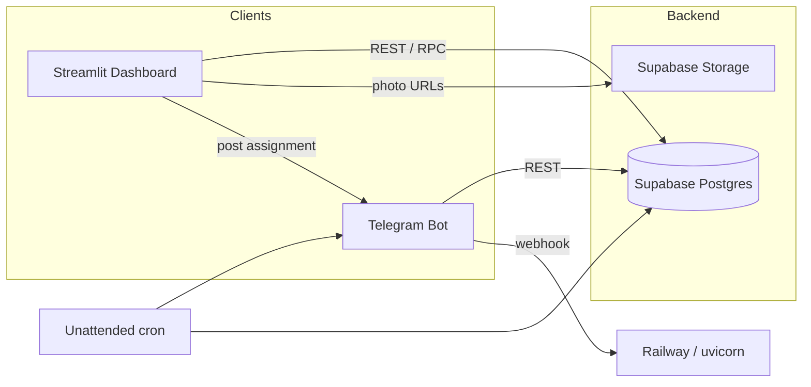
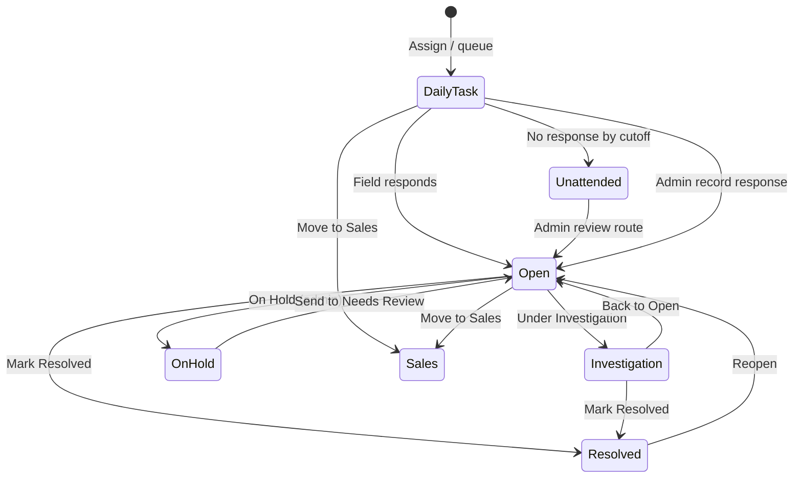
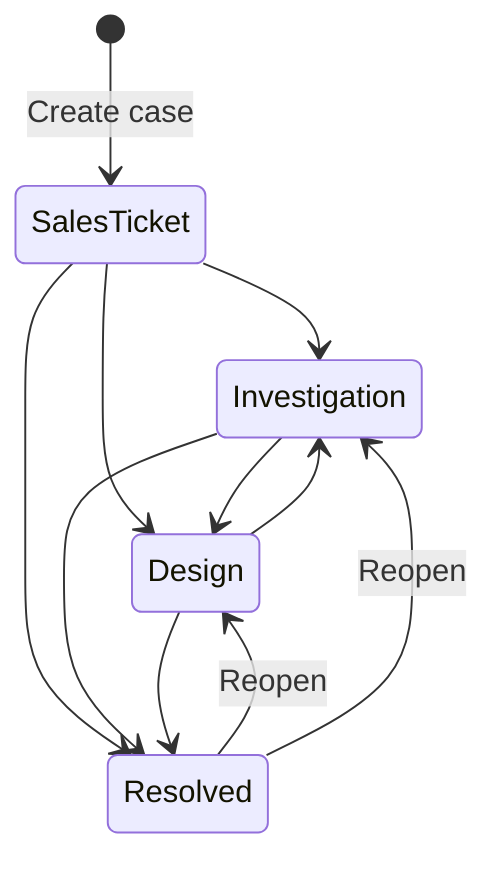

# NetOps Coverage Eye — Developer Requirements Document

**Product:** NetOps · Coverage Eye (TELEBOT)  
**Stack:** Streamlit dashboard (`app.py`), UI theme/layout (`dispatch_console.py`), Telegram bot (`bot.py`), Supabase (Postgres + Storage), optional React staff matrix (`components/staff_matrix/`)  
**Timezone:** UTC+5 for operator-facing dates, Log filters, and Performance week boundaries (Sun–Sat)  
**Audience:** Developers, IT, integrators rebuilding or extending the system  
**Version:** 2026-06 (dispatch console + Performance rebuild)

---

## 1. Purpose & Scope

Coverage Eye is an operations dashboard for managing **field complaint tickets (CSM Cases)** and **sales cases** end-to-end: assignment via Telegram, field response capture, admin review, performance analytics, and append-only audit logging.

This document defines:

- All screens, layouts, and navigation
- Roles and permissions
- Logical data entities and fields
- Workflows and state machines
- Integrations (Telegram, Supabase)
- Session state and cross-screen navigation
- Non-functional requirements

**Related docs:** [DATABASE_SCHEMA.md](./DATABASE_SCHEMA.md) · [USER_STORIES.md](./USER_STORIES.md)

---

## 2. System Architecture

| Component | Responsibility |
|-----------|----------------|
| **Streamlit dashboard** | Login, CSM/Sales dispatch floors, Log, Performance analytics |
| **dispatch_console.py** | Dark ops theme, 3-column layout helpers, queue chips, table renderers |
| **Telegram bot** | Field assignment messages, swipe-reply, `/respond`, coordinator parsing |
| **Supabase** | Tickets, visits, sales cases, users, audit log, storage |
| **Unattended worker** (`unattended.py`) | 6h nudge + end-of-day auto-close for unanswered Daily Task tickets |
| **Staff matrix (React)** | Performance → Case Info grid (requires `npm run build` in `components/staff_matrix/frontend`) |

---

## 3. Roles & Access Control

There is **no per-row RBAC in Postgres**. Access is enforced in the UI and via environment configuration. Supabase uses the anon key with RLS; dashboard auth uses SECURITY DEFINER RPCs.

| Role | Identification | Capabilities |
|------|----------------|--------------|
| **Unauthenticated user** | No session | Login screen only |
| **Dashboard operator** | `dashboard_users` login **or** legacy shared password + Operator ID | All main tabs; most CSM/sales queue actions |
| **Dashboard admin** | Username ∈ `DASHBOARD_ADMIN_USERNAMES` (default: `admin`, `ibeyx`) | Operator capabilities **plus** admin-only CSM actions (§3.1) |
| **Field engineer** | `@handle` in `dashboard_field_engineers` (active) | Telegram assignments and replies — **no dashboard login** |
| **System / bot** | `bot.py`, `unattended.py` | Auto status changes, attendance logging, visit cycles |

**Sales Coordinator** is not a separate role flag — any authenticated operator with Operator ID may manage sales cases.

### 3.1 Admin-only CSM actions

| Action | Queues |
|--------|--------|
| Move to **On Hold** | Daily Task, Needs Review, Investigation |
| **Record response** (manual field reply) | Daily Task, Needs Review, On Hold |
| **Reassign** | Daily Task, On Hold |
| **Admin close** | Most active queues |
| **Team accounts** (create/disable users) | Admin RPC panel (when exposed in UI) |

Non-admins may: edit assignment, reassign on Needs Review / Investigation, resolve, move to sales, delete, view photos.

**Sales cases:** No admin-role gate — any authenticated operator may act.

### 3.2 Authentication

| Mode | Trigger | Flow |
|------|---------|------|
| **Per-user (preferred)** | `dashboard_users` table populated | Username + password → RPC `dashboard_verify_login` |
| **Legacy shared password** | No active dashboard users | `DASHBOARD_PASSWORD` + Operator ID; optional `DASHBOARD_OPERATOR_ALLOWLIST` |
| **Password reset** | Forgot password link | Request code → `dashboard_request_password_reset` → `dashboard_reset_password` (15 min, min 8 chars) |

**Session keys:** `_ticket_dashboard_auth_ok`, `_ticket_dashboard_auth_username`, `_ticket_dashboard_operator_id`, fingerprint via `DASHBOARD_SESSION_SECRET`.

**Operator ID** is required for assignments — stored as `dashboard_assigned_by` on tickets and in attendance logs.

### 3.3 Admin RPCs (password re-entry required)

`dashboard_admin_list_users`, `dashboard_admin_create_user`, `dashboard_admin_set_user_active`

---

## 4. Global UI Chrome (Authenticated)

Rendered by `_render_dispatch_app_shell()` on every post-login screen.

### 4.1 Header (56px single row)

| Element | Location | Behavior |
|---------|----------|----------|
| **Brand** | Left | “NetOps · Coverage Eye” |
| **Main nav** | Center | Tab buttons: CSM cases · Sales cases · Log · Performance |
| **Clock + operator** | Right | Local date/time (UTC+5), signed-in operator display name |
| **⚙ Settings** | Right | Popover (see §4.2) |

### 4.2 Settings popover

| Control | Effect |
|---------|--------|
| Auto-refresh toggle + interval (1–60 min) | Polls attendance for new Telegram activity |
| **Time range** | Today · This week · Last 30 days · Custom (From/To) |
| Refresh now | Reloads data |
| Sign out | Clears session |

**Time range** filters Log and Performance in-range metrics. **Active CSM queue rows** (non-Resolved) remain visible regardless of range.

### 4.3 Legacy UI (code present, not wired in `main()`)

- Streamlit sidebar Command Center (`_sidebar_controls`)
- ☰ header menu (`_render_app_menu_panel`)
- Global metrics row above content
- Legacy checkbox CSM table after `return` in `_render_dashboard()`

**Current assignment UX:** Inline panels on CSM/Sales center columns + engineer/category manage dialogs.

---

## 5. Screen: Login

| View | Fields / actions |
|------|------------------|
| **Sign in** | Username + password (per-user) **or** shared password + Operator ID (legacy); Save Password; Forgot Password |
| **Forgot request** | Username → reset code emailed/stored |
| **Forgot reset** | 8-char code + new password |

Supabase connectivity banner when unreachable. Branding: NetOps / Coverage Eye.

---

## 6. Screen: CSM Cases

**Table:** `tickets_active` (`TICKETS_TABLE`)  
**Layout:** 3-column dispatch console (`disp_csm_body`)

### 6.1 Column layout

| Column | Section | Contents |
|--------|---------|----------|
| **Left sidebar** | Today | Metrics: Assigned, Responded, Daily task, Unattended |
| | Queues | Clickable queue list with counts (`QUEUE_ORDER`) |
| | Engineers | Field engineer presence (active ticket counts); ⋯ manage engineers |
| **Center** | New ticket panel | Mode: **Assign + Telegram** vs **Queue only** |
| | | Fields: ticket #, engineer 1, engineer 2 (optional), category, notes |
| | | Submit: Assign / Add to Daily Task |
| | Queue table | Search by ticket #; selectable rows; ⋯ row actions |
| | Row modals | Edit assignment, Reassign, Record response, Admin close, View photos |
| **Right detail panel** | Ticket detail | Status, category, engineer(s), notes, field response, site photo, attendance timeline (last 6) |

### 6.2 Queue tabs (status-driven)

| UI label | DB `status` | Purpose |
|----------|-------------|---------|
| Daily Task | `Daily Task` | Awaiting field response |
| Needs Review | `Open` | Post-reply admin review |
| On Hold | `On Hold` | Admin chase queue |
| Under Investigation | `Under Investigation` | Long-running; follow-ups |
| Unattended | `Unattended` | Permanent no-response record |
| Resolved | `Resolved` | Closed |

**Visibility:** Active queue tickets (Daily Task, Open, On Hold, Under Investigation, Unattended) always shown; Resolved filtered by time range where applicable.

### 6.3 Ticket fields

| Field | Editable | Notes |
|-------|----------|-------|
| `ticket_number` | On create | PK; 9 or 16 digits |
| `assigned_to`, `assigned_to_2` | Yes | `@handle` lowercase |
| `task_category` | Yes | From `dashboard_task_categories` |
| `outcome_category` | On resolve | Performance credit category |
| `status` | Via actions | §10.1 |
| `field_response`, `photo_url` | Bot / admin record | Latest field reply |
| `responded_at`, `field_responded_by` | System | |
| `additional_info` | Yes | Assignment notes |
| `dashboard_assigned_by` | System | Operator who assigned |
| `last_assigned_at` | System | Reassign timestamp |
| `marked_unattended_at` | System | Permanent unattended |
| `follow_up_at`, `follow_up_note` | Yes | Investigation follow-up |
| Telegram message IDs | System | Assignment/reply message refs |
| `created_at`, `updated_at` | System | |

### 6.4 Per-row ⋯ actions (status-aware)

| Action | Daily Task | Needs Review | On Hold | Investigation | Resolved | Unattended |
|--------|:----------:|:------------:|:-------:|:-------------:|:--------:|:----------:|
| → Investigation | ✓ | ✓ | ✓ | — | — | — |
| → On Hold | Admin | Admin | — | Admin | — | — |
| → Resolved | — | ✓ | — | ✓ | — | — |
| → Needs Review | — | — | ✓ | ✓ | ✓ | — |
| → Daily Task | — | — | — | — | — | ✓ |
| Edit assignment | ✓ | ✓ | ✓ | ✓ | — | — |
| Reassign | Admin | ✓ | Admin | ✓ | — | — |
| Record response | Admin | Admin | Admin | — | — | — |
| Admin close | Admin | Admin | Admin | Admin | — | — |
| View photos | — | ✓ | — | ✓ | ✓ | — |
| Move to Sales | ✓ | ✓ | ✓ | ✓ | — | — |
| Delete | ✓ | ✓ | ✓ | ✓ | ✓ | ✓ |

### 6.5 Inline assign panel fields

| Field | Required | Notes |
|-------|----------|-------|
| Assign mode | — | `telegram` (default) or `queue_only` |
| Engineer 1 | If telegram mode | From active `dashboard_field_engineers` |
| Engineer 2 | No | Shared assignment |
| Ticket # | Yes | Creates/updates row |
| Category | Yes | Task category picklist |
| Notes | No | `additional_info` |
| **Assign** / **Add to Daily Task** | — | Opens `ticket_visits` cycle; posts Telegram if not queue-only |

**Manage dialogs:** Field engineers (add/deactivate), task categories (add/delete).

---

## 7. Screen: Sales Cases

**Table:** `dashboard_sales_cases` (`SALES_CASES_TABLE`)  
**Layout:** 3-column dispatch console (mirrors CSM)

### 7.1 Column layout

| Column | Contents |
|--------|----------|
| **Left** | Today metrics (New, Resolved, Investigation, Design); sales queue list; engineer presence |
| **Center** | New case panel (Intake only vs Assign engineer); case table + search; row ⋯ menus; inline expanders |
| **Right** | Case detail: ref, status, account, priority, engineer, notes, attended_by, timeline |

### 7.2 Queue tabs

| UI queue | DB `status` values |
|----------|-------------------|
| Sales ticket | `Sales ticket` |
| Investigation | `Investigation`, `Regional for site visit` |
| Design | `Design` |
| Resolved | `Resolved` |

Legacy status strings mapped via `_SC_LEGACY_STATUS_MAP`.

### 7.3 Sales case fields

| Field | Required on create | Notes |
|-------|-------------------|-------|
| `case_ref` | Yes | External ticket/case ID |
| `account_name` | Yes | Customer/resort name |
| `attended_by` | System | **Always `Admin`** in current app (queue bucket) |
| `sales_priority` | Yes | Strategic, High, Urgent, Standard |
| `account_region` | Yes | SOC, EOC, KOC, LOC, AOC, GOC, CENTRAL |
| `sales_category` | Yes | Intent/category |
| `description` | No | Intake notes |
| `status` | System | Queue driver |
| `admin_owner` | System | Last operator (operational metadata) |
| `dispatch_type`, `dispatch_region` | On site visit | |
| `assigned_to`, `assigned_to_2` | On dispatch | Field engineer(s) |
| `field_task_category`, `dispatch_reason` | On dispatch | |
| `additional_info` | No | Work notes |
| `close_note` | On resolve | |
| `last_assigned_at`, `created_at`, `updated_at` | System | |

### 7.4 Row actions

Move to (status transitions), Edit details, Assign engineer, Delete (Resolved only). Expanders for resolve/edit/assign on selected row.

### 7.5 Status transitions

| From | Allowed moves |
|------|---------------|
| Sales ticket | → Investigation, Design, Resolved |
| Investigation | → Design, Resolved |
| Design | → Investigation, Resolved |
| Resolved | → Design, Investigation (reopen); delete allowed |

### 7.6 New case panel

| Field | Notes |
|-------|-------|
| Mode | `intake` (no engineer) or `assign` |
| Case ref, account, region, priority, category | Required |
| Engineer(s) | Required when assign mode or CENTRAL region rules apply |
| Notes | `description` |

---

## 8. Screen: Log

**Table:** `ticket_attendance_logs`

| Column | Description |
|--------|-------------|
| `timestamp` | Event time (UTC stored; displayed UTC+5) |
| `ticket_number` | Field ticket # **or** sales `case_ref` |
| `member_username` | Actor `@handle` or Operator ID |
| `action_type` | Assignment, Response, Resolved, OnHold, LegacyLogin, etc. |
| `note` | Free text |
| `photo_url` | Optional image |

**Filters:** Global time range (Settings), optional Ticket #, optional Member  
**Display:** Sortable table + Timeline expander with photo thumbnails  
**Access:** Read-only; all authenticated users

---

## 9. Screen: Performance

**Layout:** 3-column (`disp_perf_body`: sidebar 1.5 · main 4.3 · detail 2.4)

### 9.1 Left sidebar controls

| Control | Session key | Effect |
|---------|-------------|--------|
| Focus assignee | `perf_focus_assignee` | All engineers or one `@handle` — filters all views |
| Range | `perf_range` + UTC bounds | Today / This week / Last 30 days / Custom |
| View (radio) | `perf_active_view` | One of seven views below |

### 9.2 Metric strip (main column top)

Cards: **TOTAL**, **DAILY TASK**, **REVIEW**, **ON HOLD**, **RESOLVED**, **INVESTIGATION**, **UNATTENDED**, **SALES**

Respects Focus assignee. Snapshot queue counts **ignore sidebar range** (current queue credit).

### 9.3 Views

| View | Count basis | Content |
|------|-------------|---------|
| **Overview** | Queue snapshot | Solo/shared chart (assignment-based), queue strip, field + sales charts; click row → detail panel |
| **Weekly** | Calendar week Sun–Sat UTC+5 | Executive attended report (ignores sidebar range for week boundary) |
| **Sales cases** | Range + focus | Sales charts/tables; jump to Sales tab |
| **Case info** | Range + focus | Multi-staff matrix (React if built, else HTML fallback); CSM + sales activity |
| **Handled** | Range + focus | Resolved + Investigation field tickets and qualifying sales; visit fair credit |
| **On hold** | Range | On-hold breakdown by assignee |
| **Unattended** | Range | Accountability list; “View tickets →” jumps to CSM Unattended + engineer filter |

### 9.4 Right detail panel

When engineer/row selected (`perf_selected_engineer`):

- Solo / shared / sales counts (assignment snapshot for solo/shared)
- Resolved / unattended in range
- Avg response time (from visits)
- Recent tickets and sales with **View →** jump links

### 9.5 Credit rules

| Track | Performance credit |
|-------|-------------------|
| Field ticket | Engineer on `assigned_to` / `assigned_to_2` |
| Sales case | Field engineer if `assigned_to` set; else **Admin** bucket |
| `admin_owner` | Operational only — **not** performance credit |
| Solo vs shared (Overview) | **Assignment-based** queue snapshot: solo = one assignee; shared = two assignees; each engineer credited on co-assigned tickets |
| Visit fair credit | Distinct tickets per assignee with `outcome = responded` in range |
| Unattended | Excluded from Overview credit, Handled, Weekly |

### 9.6 Cross-tab navigation

Performance sets `_dash_pending_main_nav`, `_dash_pending_ticket_select`, `_dash_pending_sales_select`, `_dash_pending_engineer_filter` then reruns. Applied in `_apply_pending_dashboard_nav()` before widgets render.

---

## 10. Workflows & State Machines

### 10.1 CSM ticket lifecycle

### 10.2 Sales case lifecycle

### 10.3 Visit cycle (`ticket_visits`)

Each assignment opens a visit row (`is_active = true`). On reassign or close:

- Prior active visit closed with outcome: `assigned`, `responded`, `reassigned`, `unattended`, `on_hold`
- New visit inserted on reassign

**Trigger:** `handle_ticket_reassignment()` — one active visit per ticket.

### 10.4 Unattended automation

| Job | Timing | Action |
|-----|--------|--------|
| **Nudge** | 6h after assign, no response | Telegram reminder; log `Nudge` |
| **Auto-close** | After assign-day cutoff (default 23:59 UTC+5) | Status → Unattended; `marked_unattended_at`; route to Open; log `AutoUnattended` |

Env: `UNATTENDED_NUDGE_HOURS`, `ASSIGN_DAY_CUTOFF_HOUR`, `CRON_SECRET`

### 10.5 Telegram field response

1. Dashboard posts assignment to group chat  
2. Engineer swipe-replies or `/respond`  
3. Bot updates `tickets_active`, closes visit as `responded`, appends attendance log  
4. Status: Daily Task → Open (Needs Review)

---

## 11. Session State Reference

| Key | Purpose |
|-----|---------|
| `_dash_main_nav` | Active tab |
| `_dash_pending_main_nav` | Deferred tab switch |
| `active_queue` / `_dash_pending_ticket_queue` | CSM queue |
| `disp_selected_ticket` / `_dash_pending_ticket_select` | Selected CSM ticket |
| `disp_engineer_filter` / `_dash_pending_engineer_filter` | Engineer filter on CSM table |
| `active_sales_queue` / `_dash_pending_sales_queue` | Sales queue |
| `selected_sales_case` / `_dash_pending_sales_select` | Selected sales case |
| `disp_assign_mode`, `sales_assign_mode` | Assign panel modes |
| `perf_focus_assignee`, `perf_range`, `perf_active_view` | Performance filters |
| `perf_selected_engineer` | Performance detail panel |
| `_dash_time_preset`, `_dash_range_from_utc`, `_dash_range_to_utc` | Global time range |

Row modal keys: `disp_row_edit_ticket`, `disp_row_reassign_ticket`, `disp_row_record_ticket`, `disp_row_close_ticket`, `disp_row_photo_ticket`

---

## 12. Integrations

### 12.1 Supabase tables (env overrides)

| Env var | Default |
|---------|---------|
| `TICKETS_TABLE` | `tickets_active` |
| `SALES_CASES_TABLE` | `dashboard_sales_cases` |
| `ATTENDANCE_LOGS_TABLE` | `ticket_attendance_logs` |
| `TICKET_VISITS_TABLE` | `ticket_visits` |
| `FIELD_ENGINEERS_TABLE` | `dashboard_field_engineers` |
| `TASK_CATEGORIES_TABLE` | `dashboard_task_categories` |
| `BOT_SESSIONS_TABLE` | `bot_sessions` |
| `TICKET_PHOTOS_BUCKET` | `ticket-photos` |

### 12.2 Telegram

| Env var | Purpose |
|---------|---------|
| `TELEGRAM_TOKEN` | Bot API |
| `TELEGRAM_GROUP_CHAT_ID` | Assignment group |
| `TELEGRAM_WEBHOOK_SECRET` | Webhook validation |
| `TELEGRAM_ALLOWED_USERNAMES` | Optional `/respond` gate |

### 12.3 Auth / admin env

| Env var | Purpose |
|---------|---------|
| `DASHBOARD_ADMIN_USERNAMES` | Admin usernames (default `admin,ibeyx`) |
| `DASHBOARD_PASSWORD` | Legacy shared password |
| `DASHBOARD_OPERATOR_ALLOWLIST` | Legacy Operator ID allowlist |
| `DASHBOARD_SESSION_SECRET` | Session cookie pepper |

---

## 13. Validation Rules

| Rule | Enforcement |
|------|-------------|
| Ticket # = 9 or 16 digits | Assign panels, matrix lookup |
| `@handle` lowercase canonical | Assignment, visits, attendance |
| One active visit per ticket | DB trigger |
| `updated_at` auto-set on ticket update | Trigger |
| Outcome category on resolve | Dashboard UI |
| Password min 8 chars | Reset RPC |
| Sales CENTRAL + assign mode requires engineer | Sales assign panel |

---

## 14. Non-Functional Requirements

| Requirement | Target |
|-------------|--------|
| Timezone | UTC+5 operator labels; Performance week Sun–Sat local |
| Audit | Append-only attendance log; visits preserved |
| Photos | Supabase Storage public bucket |
| Performance matrix | React virtualized grid; HTML fallback capped at 40 tickets |
| Security | RLS on tables; dashboard users via RPC; webhook secret |
| Refresh | Auto-refresh 1–60 min; manual refresh |
| Min UI font | 11px floor for micro labels |

---

## 15. Deployment Checklist

1. Apply `supabase/migrations/` in filename order  
2. Configure `.env` from `.env.example`  
3. Seed `dashboard_users`, `dashboard_field_engineers`, `dashboard_task_categories`  
4. Deploy bot (webhook) and dashboard (Streamlit) on separate ports  
5. Set Telegram webhook with secret  
6. Build staff matrix: `cd components/staff_matrix/frontend && npm install && npm run build`  
7. Configure unattended cron with `CRON_SECRET`

---

## 16. Out of Scope / Known Limits

- No native mobile app (Telegram is field channel)  
- No row-level permissions beyond admin flag  
- Sales cases do not use `ticket_visits` (matrix uses sales metadata + attendance)  
- `ticket_responses` is legacy bot fallback  
- Admin team-accounts UI exists in legacy menu path; RPCs available regardless  
- Legacy Command Center sidebar code retained but not mounted in `main()`
