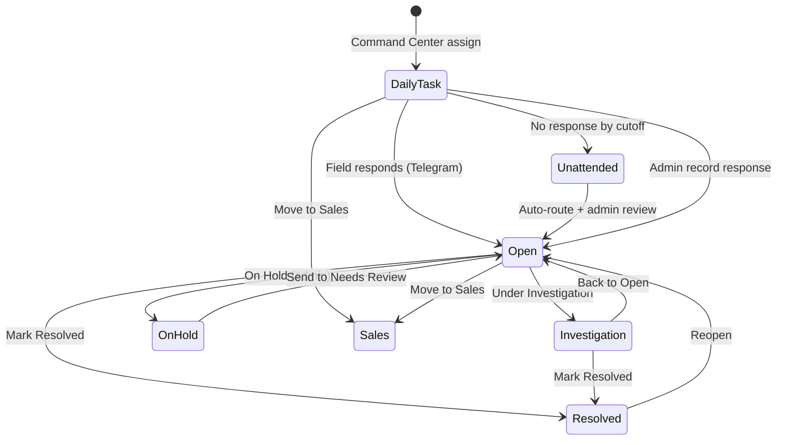
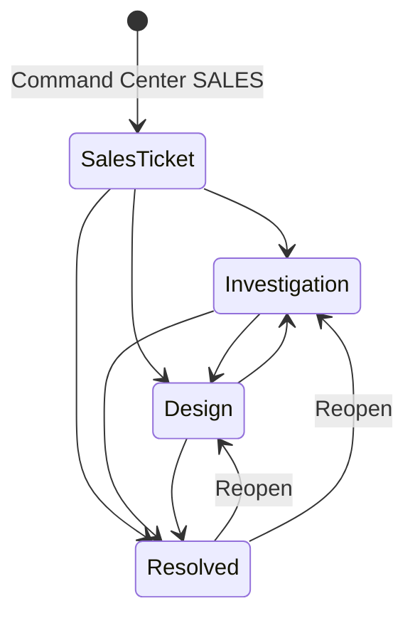

# NetOps Coverage Eye — Developer Requirements Document

**Product:** NetOps | Coverage Eye (TELEBOT)  
**Stack:** Streamlit dashboard (`app.py`), Telegram bot (`bot.py`), Supabase (Postgres + Storage), optional React matrix (`components/staff_matrix/`)  
**Timezone:** UTC+5 for all operator-facing dates and Performance week boundaries (Sun–Sat)  
**Audience:** Developers, IT, integrators rebuilding or extending the system

---

## 1. Purpose & Scope

Coverage Eye is an operations dashboard for managing **field complaint tickets (CSM Cases)** and **sales cases** end-to-end: assignment via Telegram, field response capture, admin review, performance analytics, and audit logging.

This document defines:

- All screens and navigation
- Roles and permissions
- Data entities and fields (logical model)
- Workflows and state machines
- Integrations (Telegram, Supabase)
- Non-functional requirements

---

## 2. System Architecture

| Component | Responsibility |
|-----------|----------------|
| **Streamlit dashboard** | Login, queues, Command Center, Log, Performance |
| **Telegram bot** | Field assignment messages, `/respond`, swipe-reply capture, coordinator assignment parsing |
| **Supabase** | Single source of truth for tickets, visits, sales cases, users, audit log |
| **Unattended worker** | 6h nudge + end-of-day auto-close for unanswered Daily Task tickets |
| **Staff matrix (React)** | Optional Performance → Case Info grid (built via `npm run build` in `components/staff_matrix/frontend`) |

---

## 3. Roles & Access Control

There is no per-row RBAC in the database. Access is enforced in the UI and via env configuration.

| Role | Identification | Capabilities |
|------|----------------|--------------|
| **Unauthenticated user** | No session | Login screen only |
| **Dashboard operator** | `dashboard_users` login **or** legacy shared password + Operator ID | Queues, Command Center, Sales Cases, Log, Performance; most queue actions |
| **Dashboard admin** | Operator whose username ∈ `DASHBOARD_ADMIN_USERNAMES` (default: `admin`, `ibeyx`) | All operator capabilities **plus** admin-only actions (see §3.1) |
| **Field engineer** | Telegram `@handle` in `dashboard_field_engineers` | Receives assignments; replies via Telegram (not dashboard login) |
| **System / bot** | `bot.py`, `unattended.py` | Auto status changes, attendance logging, visit cycle updates |

### 3.1 Admin-only actions

| Action | Location |
|--------|----------|
| Move ticket to **On Hold** | CSM queue status actions |
| **Record response** (manual field reply) | Daily Task, On Hold, Open |
| **Reassign** | Daily Task, On Hold |
| **Admin close** | Actions expander on most queues |
| **Team accounts** (create/disable users) | ☰ menu → Admin |

All other signed-in operators may: edit assignment, reassign on Open/Investigation, resolve, move to sales, manage sales cases, view Log/Performance.

### 3.2 Authentication modes

1. **Per-user (preferred):** Username + password → Supabase RPC `dashboard_verify_login`
2. **Legacy:** Shared `DASHBOARD_PASSWORD` + Operator ID; optional `DASHBOARD_OPERATOR_ALLOWLIST`
3. **Password reset:** Request code → `dashboard_request_password_reset` → `dashboard_reset_password` (15 min validity)

**Session requirements:** Operator ID must be set for Command Center assignments (stored as `dashboard_assigned_by` on tickets and in attendance logs).

---

## 4. Global UI Chrome

Present on every authenticated screen.

### 4.1 Top bar

| Element | Behavior |
|---------|----------|
| Brand | "NetOps \| Coverage Eye" |
| Time range caption | Active filter label (UTC+5) |
| Operator chip | Signed-in operator display name |
| ☰ menu | Opens header dropdown |

### 4.2 Header menu (☰)

| Section | Fields / controls | Effect |
|---------|-------------------|--------|
| **Time range** | Today, This week, Last 30 days, Custom (From/To) | Filters Log, Performance tabs, and in-range ticket visibility; **active queue rows always visible** |
| **Assign** | Toggle | Opens/closes Command Center sidebar |
| **Admin** | Team accounts | Admin only; user CRUD via RPC |
| **Filters** | Auto-refresh toggle, interval (1–60 min), Look Up Ticket #, Refresh now | Polling + manual refresh |
| **Log out** | Button | Clears session |

### 4.3 Global metrics row

Clickable counts (navigate to queue):

| Metric | Source |
|--------|--------|
| Assigned today | Assignments in local today |
| Responded today | Field responses in local today |
| Daily Task (in view) | Queue count in current view |
| Unattended (in view) | Permanent unattended count |

### 4.4 Command Center sidebar

**Mode radio:** CSM | SALES

#### CSM assign form

| Field | Required | Notes |
|-------|----------|-------|
| Add to Daily Task Only | No | Skips engineer + Telegram |
| Engineer 1 | Conditional | Required unless Daily Task Only |
| Engineer 2 | No | Optional second assignee |
| Ticket # | Yes | 9 or 16 digit ID |
| Category | Yes | From `dashboard_task_categories` |
| Notes | No | `additional_info` |
| Bot Token / Group Chat ID | No | Session override if env unset |
| **Assign** / **Add to Daily Task** | — | Creates/updates `tickets_active`, posts Telegram, opens `ticket_visits` cycle |

**Popovers:** Edit team (field engineers), Edit categories (task categories)

#### SALES intake form

| Field | Required | Notes |
|-------|----------|-------|
| Add to Daily Task Only | No | No engineer/Telegram |
| Ticket # (case ref) | Yes | Stored as `case_ref` |
| Resort/Company name | Yes | `account_name` |
| Sales priority | Yes | Default Standard |
| Region team | Yes | SOC, EOC, KOC, LOC, AOC, GOC, CENTRAL |
| Engineer(s) | Conditional | CENTRAL region + not skip-assign |
| Sales Category (Intent) | Yes | |
| Notes | No | `description` |
| **Create Sales Case** / **Assign** | — | Inserts `dashboard_sales_cases` |

---

## 5. Main Navigation

Horizontal nav: **CSM Cases** | **Sales Cases** | **Log** | **Performance**

---

## 6. Screen: CSM Cases (Field Tickets)

**Table:** `tickets_active` (env: `TICKETS_TABLE`)

### 6.1 Queue tabs (status-driven)

| Queue label | DB status | Purpose |
|-------------|-----------|---------|
| Daily Task | `Daily Task` | Awaiting field response |
| Needs Review | `Open` | Admin review after field reply or auto-route |
| On Hold | `On Hold` | Admin chase queue |
| Investigation | `Under Investigation` | Long-running; follow-ups pinned (●) |
| Resolved | `Resolved` | Closed |
| Unattended | `Unattended` | Permanent no-response record |

**Visibility rule:** Rows in active queues (not Resolved) remain visible even outside the sidebar time range.

### 6.2 Ticket row data (display + edit)

| Field | Editable | Notes |
|-------|----------|-------|
| `ticket_number` | On create | Primary key |
| `assigned_to`, `assigned_to_2` | Yes | `@handle` normalized lowercase |
| `task_category` | Yes | Assigned category |
| `outcome_category` | On resolve | Performance credit category |
| `status` | Via actions | See state machine §10.1 |
| `field_response` | Bot / admin record | Text reply |
| `photo_url` | Bot / admin record | Supabase storage URL |
| `responded_at` | System | Last field response time |
| `field_responded_by` | System | Telegram replier |
| `additional_info` | Yes | Assignment notes |
| `dashboard_assigned_by` | System | Operator who assigned |
| `last_assigned_at` | System | Reassign timestamp |
| `marked_unattended_at` | System | Permanent unattended flag |
| `follow_up_at`, `follow_up_note` | Yes | Investigation follow-up |
| `created_at`, `updated_at` | System | |

### 6.3 Per-queue actions matrix

| Action | Daily Task | Open | On Hold | Investigation | Resolved | Unattended |
|--------|:----------:|:----:|:-------:|:-------------:|:--------:|:----------:|
| → Under Investigation | ✓ | ✓ | ✓ | — | — | — |
| → On Hold | Admin | Admin | — | Admin | — | — |
| → Mark Resolved | — | ✓ | — | ✓ | — | — |
| → Send to Open / Needs Review | — | — | ✓ | ✓ | ✓ | — |
| → Send to Daily Task | — | — | — | — | — | ✓ |
| Edit assignment | ✓ | ✓ | ✓ | ✓ | — | — |
| Reassign | Admin | ✓ | Admin | ✓ | — | — |
| Record response | Admin | Admin | Admin | — | — | — |
| Admin close | Admin | Admin | Admin | Admin | — | — |
| Follow-up | — | ✓ | — | ✓ | — | — |
| Photo gallery | — | ✓ | — | ✓ | ✓ | — |
| Remove (delete) | ✓ | ✓ | ✓ | ✓ | ✓ | ✓ |
| Move to Sales | ✓ | ✓ | ✓ | ✓ | — | — |

### 6.4 Shared table UX

- Row selection → **Actions** popover (includes ticket search)
- Inline **Edit assignment** / **Reassign** editors
- **Mark Resolved** prompts outcome category (feeds Performance credit)
- Toolbar search filters by ticket number (session-persisted)

---

## 7. Screen: Sales Cases

**Table:** `dashboard_sales_cases` (env: `SALES_CASES_TABLE`)

### 7.1 Queue tabs

| Queue | Status values |
|-------|---------------|
| Sales Ticket | `Sales ticket` |
| Investigation | `Investigation`, `Regional for site visit` |
| Design | `Design` |
| Resolved | `Resolved` |

Legacy status strings are mapped via `_SC_LEGACY_STATUS_MAP` in code.

### 7.2 Sales case fields

| Field | Required on create | Notes |
|-------|-------------------|-------|
| `case_ref` | Yes | External ticket/case ID |
| `account_name` | Yes | Customer/resort name |
| `attended_by` | Yes | Sales queue owner (default Mular_s) |
| `sales_priority` | Yes | e.g. Standard |
| `account_region` | Yes | Regional team code |
| `sales_category` | Yes | Intent/category |
| `description` | No | Intake notes |
| `status` | System | Queue driver |
| `admin_owner` | System | Last admin operator |
| `dispatch_type`, `dispatch_region` | On site visit | |
| `assigned_to`, `assigned_to_2` | On dispatch | Field engineer(s) |
| `field_task_category` | On dispatch | |
| `dispatch_reason` | No | |
| `additional_info` | No | Work panel notes |
| `close_note` | On resolve | |
| `last_assigned_at` | System | |
| `created_at`, `updated_at` | System | |

### 7.3 Work panel (single selected case)

| Tab | Actions |
|-----|---------|
| **Next Step** | Move to queue + optional comment → Apply Move |
| **Site Visit** | Assign engineer(s), optional Telegram (regional cases) |

### 7.4 Status transitions

| From | Allowed moves |
|------|---------------|
| Sales Ticket | → Investigation, Design, Resolved |
| Investigation | → Design, Resolved |
| Design | → Investigation, Resolved |
| Resolved | → Design, Investigation (reopen); delete allowed |

No admin-role gate on sales actions; any authenticated operator with Operator ID may act.

---

## 8. Screen: Log

**Table:** `ticket_attendance_logs`

| Column | Description |
|--------|-------------|
| `timestamp` | Event time (UTC) |
| `ticket_number` | Ticket or case ref |
| `member_username` | Actor `@handle` |
| `action_type` | Assignment, Response, Resolved, OnHold, LegacyLogin, etc. |

`LegacyLogin` rows appear when a user signs in with the shared `DASHBOARD_PASSWORD` (legacy mode). Filter the Log tab by **Member** (Operator ID) or widen the time range to audit these sessions.
| `note` | Free text |
| `photo_url` | Optional image |

**Filters:** Sidebar time range, optional Ticket #, optional Member  
**Display:** Sortable table + Timeline expander with photo thumbnails  
**Access:** Read-only; all authenticated users

---

## 9. Screen: Performance

Analytics for field + sales workload. Uses sidebar **time range** for tabbed metrics; queue snapshot metrics ignore range.

### 9.1 Controls

| Control | Effect |
|---------|--------|
| Focus Assignee | All or one engineer — filters all Performance tabs |
| Top metrics row | Total, Daily Task, Needs Review, On Hold, Resolved, Investigation, Unattended, Sales Cases |

### 9.2 Tabs

| Tab | Count basis | Content |
|-----|-------------|---------|
| **Overview** | Snapshot + visit range | Solo/shared board, queue strip, field + sales detail |
| **Weekly (N)** | Calendar week (Sun–Sat UTC+5) | Executive attended report (CSM + Sales) |
| **Sales Cases (N)** | Range + focus | Charts, staff bars, case list |
| **Case Info (N)** | Range + focus | Multi-staff matrix: field tickets **and sales cases**; comments/photos panel |
| **Handled (N)** | Range + focus | Resolved + Investigation field tickets **and sales cases**; visit fair credit |
| **On Hold (N)** | Range | On-hold by assignee, trends |
| **Unattended (N)** | Range | Accountability only; **excluded** from Overview credit, Handled, Weekly |

### 9.3 Credit rules

| Track | Credit assignee |
|-------|-----------------|
| Field ticket | `assigned_to` (normalized `@handle`) |
| Sales case | Field engineer if `assigned_to` set; else **Admin** |
| Visit fair credit | Distinct tickets per assignee with `outcome = responded` in range |

### 9.4 Handled logic (field)

Ticket counts when status is **Resolved** or **Under Investigation** AND any of these occurred in range:

- Handle/respond timestamp
- Reassign (`last_assigned_at`)
- Admin status update (`updated_at`)
- Visit activity on ticket

### 9.5 Handled logic (sales)

Sales case counts when status ∈ {Investigation, Regional for site visit, Resolved} AND activity timestamp falls in range (`updated_at`, `last_assigned_at`, `created_at`).

---

## 10. Workflows & State Machines

### 10.1 CSM ticket lifecycle

### 10.2 Sales case lifecycle

### 10.3 Visit cycle (`ticket_visits`)

Each assignment opens a visit row (`is_active = true`). On reassign or close:

- Prior active visit closed with outcome (`assigned`, `responded`, `reassigned`, `unattended`, `on_hold`)
- New visit row inserted if reassigned

Used for Performance Case Info matrix and fair credit.

### 10.4 Unattended automation

| Trigger | Timing | Action |
|---------|--------|--------|
| **Nudge** | 6h after assign, no field response | Telegram reminder to assignee |
| **Auto-close** | After assign-day cutoff (default 23:59 UTC+5), no same-day response | Status → Unattended; also routed to Open for review; sets `marked_unattended_at` |

Env: `UNATTENDED_NUDGE_HOURS`, `ASSIGN_DAY_CUTOFF_HOUR`, `CRON_SECRET`

### 10.5 Telegram field response flow

1. Dashboard posts assignment to group chat
2. Engineer swipe-replies or uses `/respond`
3. Bot parses ticket #, text, optional photo → updates `tickets_active`, closes visit as `responded`, appends attendance log
4. Status typically moves Daily Task → Open

---

## 11. Integrations

### 11.1 Supabase

| Env var | Default table |
|---------|---------------|
| `SUPABASE_URL`, `SUPABASE_KEY` | — |
| `TICKETS_TABLE` | `tickets_active` |
| `SALES_CASES_TABLE` | `dashboard_sales_cases` |
| `ATTENDANCE_LOGS_TABLE` | `ticket_attendance_logs` |
| `TICKET_VISITS_TABLE` | `ticket_visits` |
| `FIELD_ENGINEERS_TABLE` | `dashboard_field_engineers` |
| `TASK_CATEGORIES_TABLE` | `dashboard_task_categories` |
| `TICKET_PHOTOS_BUCKET` | `ticket-photos` |

Auth RPCs: `dashboard_verify_login`, `dashboard_admin_*`, password reset RPCs.

### 11.2 Telegram

| Env var | Purpose |
|---------|---------|
| `TELEGRAM_TOKEN` | Bot API |
| `TELEGRAM_GROUP_CHAT_ID` | Assignment group |
| `TELEGRAM_WEBHOOK_SECRET` | Webhook validation |
| `RAILWAY_PUBLIC_DOMAIN` | Webhook host |
| `TELEGRAM_ALLOWED_USERNAMES` | Optional gate for `/respond` |

### 11.3 Dashboard admin config

| Env var | Purpose |
|---------|---------|
| `DASHBOARD_ADMIN_USERNAMES` | Comma-separated admin usernames |
| `DASHBOARD_PASSWORD` | Legacy shared password |
| `DASHBOARD_OPERATOR_ALLOWLIST` | Legacy operator ID allowlist |

---

## 12. Data Validation Rules

| Rule | Where enforced |
|------|----------------|
| Ticket # = 9 or 16 digits | Command Center, matrix lookup |
| `@handle` lowercase canonical form | Assignment, visits, attendance |
| One active visit per ticket | DB trigger `trg_reassign_ticket` |
| `updated_at` auto-set on ticket update | Trigger (disable only for admin backfills) |
| Outcome category required on resolve | Dashboard UI |
| Password min 8 chars | Reset flow |
| Sales CENTRAL requires engineer unless Daily Task Only | Command Center |

---

## 13. Non-Functional Requirements

| Requirement | Target |
|-------------|--------|
| **Availability** | Dashboard + bot deployable on Railway; Streamlit separate from webhook port |
| **Timezone** | All operator labels UTC+5; Performance week = Sun–Sat local |
| **Audit** | Append-only attendance log; visit history preserved |
| **Photos** | Stored in Supabase Storage; URLs in ticket row + log |
| **Performance** | React matrix virtualized for large ticket sets; fallback HTML matrix capped |
| **Security** | RLS on all tables; dashboard users via SECURITY DEFINER RPCs; webhook secret required |
| **Refresh** | Optional auto-refresh 1–60 min; manual refresh; session state for search/filters |

---

## 14. Out of Scope / Known Limits

- No native mobile app (Telegram is field channel)
- No fine-grained row-level permissions beyond admin flag
- Sales cases do not use `ticket_visits` (matrix uses sales row metadata)
- `ticket_responses` table is legacy bot fallback; primary path is `tickets_active` + attendance log
- Matrix Case Info photo gallery for sales cases: text fields only (no visit photos)

---

## 15. Deployment Checklist for IT

1. Run Supabase migrations in `supabase/migrations/` (ordered by filename)
2. Configure `.env` from `.env.example`
3. Create initial `dashboard_users` via admin RPC or seed migration
4. Populate `dashboard_field_engineers` and `dashboard_task_categories`
5. Deploy bot (uvicorn/webhook) and dashboard (Streamlit) — separate ports
6. Set Telegram webhook with `TELEGRAM_WEBHOOK_SECRET`
7. Optional: build staff matrix (`components/staff_matrix/frontend`: `npm install && npm run build`)
8. Configure unattended cron hitting dashboard/bot endpoint with `CRON_SECRET`

---

## 16. Related Documents

- [DATABASE_SCHEMA.md](./DATABASE_SCHEMA.md) — physical schema, indexes, RLS
- [USER_STORIES.md](./USER_STORIES.md) — role-based user stories
